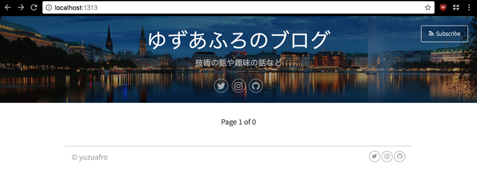

こんにちは、ゆずあふろです。  
今日はHugoでブログを作る方法について書いてみます。

この記事ではHugoをインストールして、ローカルホストで確認するところまでを試してみます。

</br>

<!--more-->

### Hugoとは
---

Hugoは静的サイトジェネレーターです。  
HugoとGitHub Pagesを使うと無料でブログサイトを公開することができます。  
コンテンツ(ブログの記事)はMarkdown形式で書くことができます。

このブログはHugo + GitHub Pagesを使って作成されています。

公式サイトは↓↓↓こちらになります。  
https://gohugo.io/

公開されているテーマを使用して、簡単にサイト作成をすることができます。  
オリジナルのテーマを公開することもできるようです。  
https://themes.gohugo.io/

</br>

### Hugoの使い方
---

#### インストール
---
[Quick Startページ](https://gohugo.io/getting-started/quick-start/) の手順通りに進めて行きます。

```bash
$ brew install hugo
```

インストールが始まります。

```bash
$ hugo version
Hugo Static Site Generator v0.38 darwin/amd64 BuildDate: 
```

v0.38がインストールされているようです。

</br>

#### サイト作成
---

hugo new siteコマンドを実行してサイトのひな形を作成します。  
blog の部分は任意の名前でよいです。

```bash
$ hugo new site blog
```

以下のような構成のフォルダ(blog)が作成されます。

```bash
$ cd blog
$ tree
.
├── archetypes
│   └── default.md
├── config.toml
├── content
├── data
├── layouts
├── static
└── themes
```

Quick Start の手順では、次にテーマを選択して、git submodule add しています。  
私は、vienna を使うことにしました。

https://themes.gohugo.io/  
https://themes.gohugo.io/vienna/  

```bash
$ git init
$ git submodule add https://themes.gohugo.io/vienna themes/vienna
```

config.toml に設定を追加していきます。  
以下はこのブログの例です。

```
baseURL = ""
languageCode = "ja-jp"
title = "ゆずあふろのブログ" 
copyright = "&copy; yuzuafro"
theme = "vienna"
paginate = 5 

[params]
  twitter = "yuzu_afro"
  github = "yuzuafro"
  instagram = "yuzukonango"
  disqus = "yuzuafro"
  subtitle = "技術の話や趣味の話など" 
```

ここまできたら、hugo serverコマンドで、ローカルホストでサイト構成を確認してみます。

```bash
$ hugo server -D -t vienna
...(省略)...
Web Server is available at //localhost:1313/ (bind address 127.0.0.1)
Press Ctrl+C to stop
```

-D は Draft(下書き)も表示する、-t はテーマを指定しています。  
config.toml で指定しているので、なくても大丈夫です。

ブラウザで、http://localhost:1313 にアクセスしてみると、作成中のサイトを確認することができます。

こんな感じです。



続いてhugo newコマンドで、ブログ記事を作成します。

```bash
$ mkdir posts/my-first-post/
$ hugo new posts/my-first-post/index.md
```

Quick Startでは posts の下に my-first-post.md を作成しているけれど、posts以下にさらに記事ごとのフォルダを作って、index.md を作成する方がおすすめです。  

なぜなら、画像ファイルなどを参照する際に、相対パスが使えるのでこちらの方が都合がよいからです。  
(今までは staticフォルダ以下に置いていたようですが、localhostでの確認時とGitHub Pagesのホスティング時にファイルパスが上手く合わせられなくてツラかったので)  


この機能はHugo v0.32以降で使用できるようです。  
https://gohugo.io/content-management/organization/

hugo serverコマンドを引き続き実行していれば、変更が保存されるたびに http://localhost:1313 ページが更新されます。


</br>

### コンテンツ(ブログ記事)の編集
---

ブログ記事のMarkdownファイルを編集していきます。
初期状態では以下のようになっています。

```
---
title: "my-first-post"
date: 2018-04-29T21:36:33+09:00
draft: true
---
```

これを編集します。  
title には記事のタイトルが入ります。  
draft は本番用の記事からは外しておきます。  
タグやカテゴリも使用することができる(テーマによってはできる)ので、記述していきます。

"---" の下から実際の記事を書きます。

```
---
title: "初めてのブログです"
date: 2018-04-29T21:36:33+09:00
categories:
- "blog"
tags:
- "sample"
---

これは初めてのブログです。  
よろしくお願いします。

## ブログを始めた経緯
---
...
```


</br>

### 各フォルダ・ファイルの役割
---

各フォルダ・ファイルの役割は以下のようになっています。  
関係ありませんが、この表を作ってみて、viennaテーマは表組みのCSSが全然整っていなくて、私は今がっかりしているところです。


| フォルダ名 | 役割 |
|:--|:--|
| archetypes | |
| config.toml | サイト全体の設定ファイル |
| content | コンテンツ(ブログ記事)のファイルを置くフォルダ |
| data | ?? |
| layouts | カスタマイズしたhtmlファイルを置く(ショートコードなど) |
| static | カスタマイズしたcssファイルやfaviconなどを置く |
| themes | テーマファイル用のフォルダ、基本的にはいじらなくてよいはず |
| public | ホスティングサーバーに置くべきファイル群、hugoコマンドを実行すると作成される |


</br>


