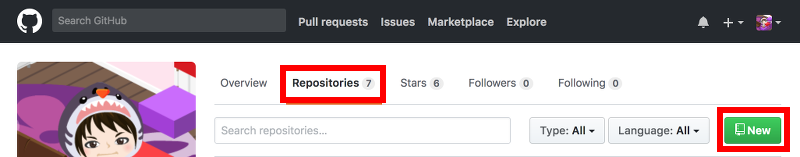
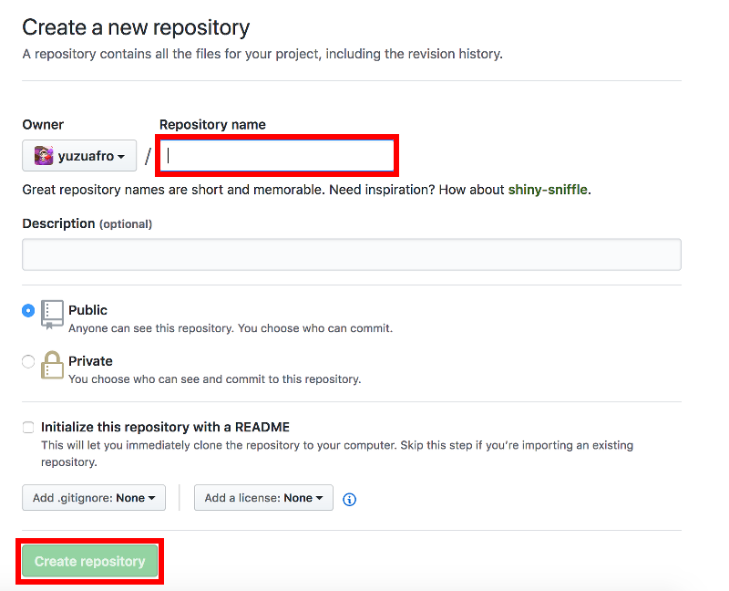
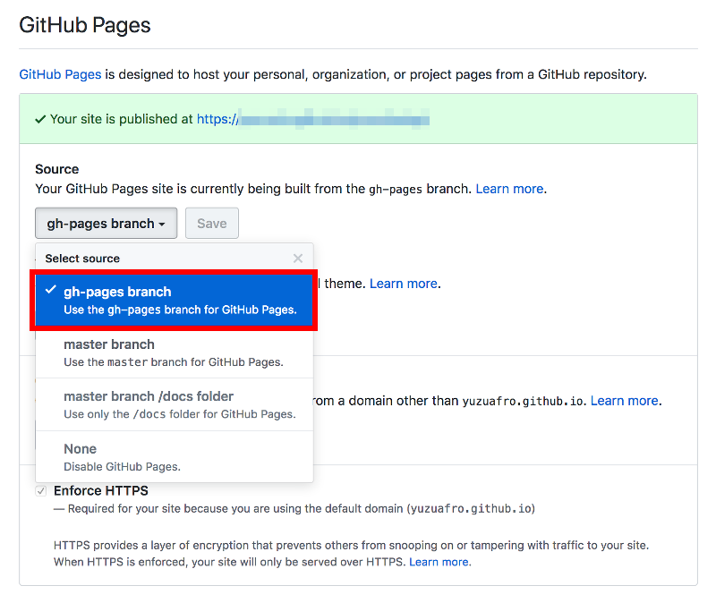

こんにちは、ゆずあふろです。  
[前回](../20180429_hugo1/) の記事では、ローカルホストでブログサイトをプレビュー表示するところまでできました。  
今回の記事では、GitHub Pagesにアップロードして、インターネット上から確認するところまでを試してみます。

<!--more-->

</br>

### この記事でやりたいこと
---

GitHub Pagesでは、Webサイトを無料で公開することができます。  
この記事では、Hugoで作成したブログサイトのファイル群を、GitHubにpushして、GitHub Pagesから閲覧できるようにします。  

GitHub Pagesのページ  
https://pages.github.com/

GitHub Pagesには "User or organization site" と "Projet site" の2種類があります。  
"User or organization site" にサイト構築をする方が簡単なのですが、1ユーザに1レポジトリになってしまうので、今回は複数個のブログを作成できる
ように "Project site" の方に作成していきます。  

ちなみに無料で使えると言っても、以下の制限があるようです。

* ソースレポジトリは推奨1GBまで
* 公開されているサイトは1GBまで
* 1ヶ月あたり100GBの帯域幅制限
* 1時間あたり10ビルドまで

https://help.github.com/articles/what-is-github-pages/

また、GitHub Pagesの設定で、どのブランチをGitHub Pagesとして使用するかを選択することができます。  
今回は、gh-pagesブランチをGitHub Pagesとして使用し、masterブランチにはサイト作成時のソースコードを登録して、1つのレポジトリでコンテンツとソースコードの両方を管理できるように作成していきます。

</br>

### 最終的に作成したいフォルダ構成
---

途中、いくつかエラーが発生したのを力技で解決してメモが残っていないので、最終的に作成したいフォルダ・ファイル構成を先に載せておきます。

重要なのは、blogフォルダ以下に publicフォルダに実際のサイト構成(HTMLなどのコンテンツ) があり、publicフォルダをgh-pagesブランチにpushすること、またそれ以外のファイルをmasterブランチにpushすることです。

```
$ pwd
/Users/(user name)/(blog path)/blog
$ tree
.
├── README.md
├── archetypes
│   └── default.md
├── config.toml
├── content
│   └── posts
│       └── my-first-post
│           └── index.md
├── data
├── deploy.sh
├── layouts
├── public
│   └── (自動生成のため省略)
├── static
└── themes
    └── vienna
        └── (省略)
```


</br>

### GitHubレポジトリの作成
---

まずは、GitHubにログインします。  
(アカウントがなければ作成してください)  
Webブラウザで以下のページを開きます。

https://github.com

個人のレポジトリのページの "Repositories" タブを選択し、"New" をクリックして、新しいレポジトリを作成します。



</br>

Repository name にブログのフォルダ名を入力し、"Create repository" をクリックします。



</br>

### コンテンツのアップロード
---

ここでいったんターミナルに戻ります。  
[前回](../20180429_hugo1) の記事で作成した blog フォルダを一時的にリネームしておきます。  

```bash
$ cd ..
$ mv blog blog_bk
```

先ほど作成したGitHubのレポジトリをcloneします。

```bash
$ git init
$ git clone https://github.com/(user name)/(repository name)
```

リネームしたコンテンツをblogフォルダに戻します。  
(もしかしたら、エラーが出ていたかもしれませんがメモが残っておらず・・・)

```bash
$ cp -r blog_bk/* blog/
$ rm -rf blog_bk
$ cd blog
```

publicフォルダを .gitignoreファイルに追記しておきます。

```bash
$ echo "public" >> .gitignore
```

gh-pagesの空ブランチを作成します。

```bash
$ git checkout --orphan gh-pages
$ git reset --hard
$ git commit --allow-empty -m "Initializing gh-pages branch"
$ git push origin gh-pages
$ git checkout master
```

hugoコマンドでのビルドとデプロイ(git push)を行います。

```bash
$ rm -rf public
$ git worktree add -B gh-pages public origin/gh-pages
$ hugo
$ cd public
$ git add --all
$ git commit -m "Publishing to gh-pages"
$ cd ..
$ git push origin gh-pages
```

ここで再びブラウザに戻って、ブログ用レポジトリの設定を変更します。

レポジトリの設定ページにアクセスします。(ユーザ名とレポジトリ名は適宜変更してください)  
https://github.com/(ユーザ名)/(レポジトリ名)/settings

下の方にある GitHub Pages の Source を gh-pages branch に変更します。


これで、GitHub Pagesでのホスティングができました。
作成されたサイトにアクセスしてみます。

https://(ユーザ名).github.io/(レポジトリ名)  
(例) https://yuzuafro.github.io/yuzuafrolog/

これでサイトが公開できました。  
ただしpublicフォルダのコンテンツファイルはgh-pagesブランチにpushされましたが、まだソースコードをpushしていません。

以下のコマンドを実行し、masterブランチにソースコードをpushします。

```bash
$ git add --all
$ git commit -m "source commit"
$ git push origin master
```

これでページ公開の流れは完了です。

次回以降のために、gh-pagesブランチへのpushをシェルスクリプトにまとめておくと便利です。  
deploy.sh としました。

```
#!/bin/sh

echo "Deleting old publication"
rm -rf public
mkdir public
git worktree prune
rm -rf .git/worktrees/public/

echo "Checking out gh-pages branch into public"
git worktree add -B gh-pages public origin/gh-pages

echo "Removing existing files"
rm -rf public/*

echo "Generating site"
hugo

echo "Updating gh-pages branch"
cd public && git add --all && git commit -m "Publishing to gh-pages (publish.sh)"
```

</br>

GitHub Pagesでのホスティングの方法については、公式のドキュメントにも手順が載っています。  
https://gohugo.io/hosting-and-deployment/hosting-on-github/  

Project siteのgh-pagesブランチにサイトを作成したい場合の手順はこちらに載っています。  
https://gohugo.io/hosting-and-deployment/hosting-on-github/#deployment-of-project-pages-from-your-gh-pages-branch  

</br>

### 2回目以降のコンテンツ作成
---

初回のページ作成は少し大変でしたが、2回目以降は以下の手順で進めればOKです。

記事の作成
```bash
$ mkdir content/posts/(記事URL)
$ hugo new posts/(記事URL)/index.md
```

記事を編集する(Markdownファイルを編集する)

deploy.sh の実行と gh-pagesブランチへのpush
```bash
$ ./deploy.sh
$ git push origin gh-pages
```

ソースコードファイルの masterブランチへのpush
```bash
$ git add --all
$ git commit -m "source commit"
$ git push origin master
```

