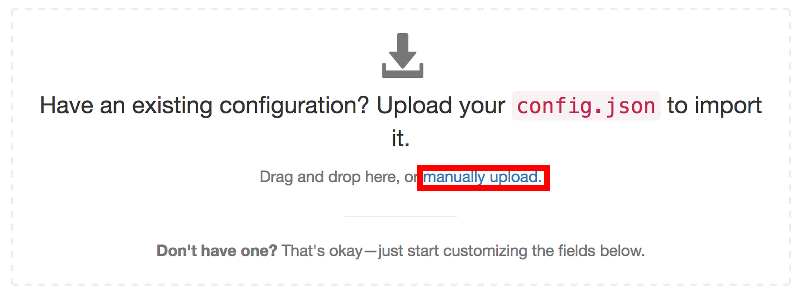
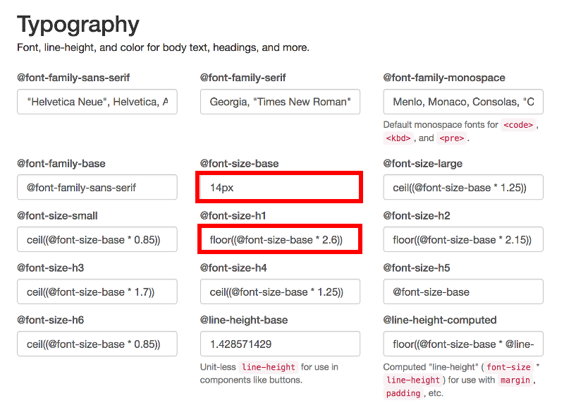
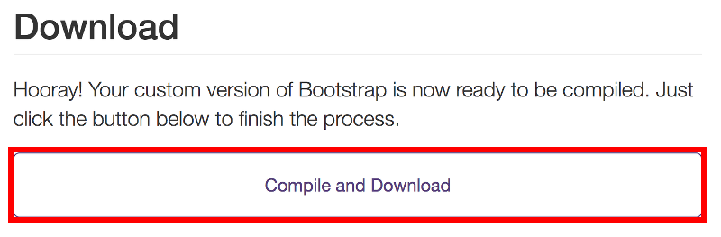

こんにちは、ゆずあふろです。  
[前回](../20180430_hugo2/) の記事では、Hugoで作成したサイトをGitHub Pagesでホスティングするところまでできました。  
今回の記事では、デザインの調整や便利機能の紹介をしていこうと思います。

<!--more-->

さて、GitHub Pagesにブログも公開できたし、めでたしめでたし！  

... となるはずだったのですが、

背景画像変えたくないですか？  
コメント欄欲しくないですか？  
なんだか文字大きくないですか？  
はてなブログの人が使ってるカード型のリンク作りたくないですか？

と、人間なので欲が出てきてしまいます。

まだまだ改造中ではあるのですが、ここまでに得られた知見をまとめておこうと思います。

---

### Tips  
[背景画像を変更する](#背景画像を変更する)  
[改行を入れる](#改行を入れる)  
[コメント欄を作成する](#コメント欄を作成する)  
[記事にカテゴリーを表示する](#記事にカテゴリーを表示する)  
[文字の大きさを変更する](#文字の大きさを変更する)  
[はてなブログカード的な機能を追加する](#はてなブログカード的な機能を追加する)  


</br>

### 背景画像を変更する
---

viennaテーマはブログタイトルに背景画像が設定されています。  
この画像も素敵なのですが、せっかくなのでオリジナルのものを使いたいということで調べてみました。  

viennaの背景画像は以下に置かれています。

```bash
themes/vienna/static/images/bg.jpg
```

これを差し替えるために、static/images/bg.jpg に自分で準備した画像を置いてみましたが、hugo serverでのプレビュー時はうまく表示できるのですが、GitHub Pagesにpushした後にどうも上手く表示できず・・・。  
(おそらくviennaテーマはUser/Organization siteを前提に作られていそうでパスが合わない)

苦肉の策として、top.jpg という名前に変更して、header.html も書き換えることにしました。  

bg.jpg を表示させている箇所は以下  
themes/vienna/layouts/partials/header.html 44行目
```html
    <header class="global-header" style="background-image:url({{ if isset .Params "image" }}{{ .Params.image }} {{ else }} /images/bg.jpg {{ end }})">
```

これを以下のように変更した header.html を layoutsフォルダに作成  
layouts/partials/header.html
```html
    <header class="global-header" style="background-image:url({{ .Site.BaseURL }}images/top.jpg)">
```

これで top.jpg を背景画像に表示できます。  
この背景画像は、3年前に乗鞍岳に登った時に撮った写真です。

ちなみに vienna は、オーストリアのウィーンのことだそうです。  
都市の名前だったのですね！

</br>

### 改行を入れる
---

記事を書いていると、微妙に改行を入れたいことがあると思います。  
以下のようなやり方がありました。

<u>一般的なMarkdownの改行</u>
```
段落を変えずに改行  (← 半角スペース2つ)
改行しました
```

段落を変えずに改行  
改行しました

</br>
<u>段落を変えて改行</u>
```
段落を変えて改行

改行しました
```

段落を変えて改行

改行しました

</br>
<u>改行コードによる改行</u>
```bash
強制的に改行を入れる
</br>
</br>
改行しました
```

強制的に改行を入れる
</br>
</br>
改行しました

</br>

### コメント欄を作成する
---

viennaテーマでは、各種外部サービスのアカウント設定に対応していて、テーマのページに記載されています。

https://themes.gohugo.io/vienna/

コメント欄の作成には Disqus というサービスのアカウントを作成します。  
(作成方法は割愛します)

https://disqus.com/

アカウントを作成できたら config.toml の [params] に設定すればオッケーです。

```
[params]
  disqus = "yuzuafro"
```

</br>

### 記事にカテゴリーを表示する
---

viennaテーマでは、各記事のタグは表示されるようですが、カテゴリーは表示されません。  
カテゴリーも表示できるようにします。

viennaテーマでタグの表示をさせているコード
themes/vienna/layouts/_default/single.html 16〜20行目
```html
      <div class="pull-right">
        {{ range .Params.tags }}
        <span class="post-tag small"><a href="{{ $baseurl }}/tags/{{ . | urlize }}">{{ . }}</a></span>
        {{ end }}
      </div>
```

single.htmlをコピーし、カテゴリーの表示もするようにして、layoutsフォルダに以下のファイルを作成する  
layouts/_default/single.html
```html
      <div class="pull-right">
        {{ range .Params.categories }}
        <span class="post-category small"><a href="{{ $baseurl }}/categories/{{ . | urlize }}">{{ . }}</a></span>
        {{ end }}
      </div>
      </br>
      <div class="pull-right">
        {{ range .Params.tags }}
        <span class="post-tag small"><a href="{{ $baseurl }}/tags/{{ . | urlize }}">{{ . }}</a></span>
        {{ end }}
      </div>
```

このままだとタグとカテゴリーが同じ色になってしまうので、カテゴリー用の色の設定をCSSファイルに記載する。

タグの色の設定をしている箇所  
themse/vienna/static/css/main.css 146行目
```css
.post-tag a { 
    padding: 0 10px;
    border: 1px solid rgba(0, 0, 0, 0.3);
    border-radius: 12px;
    color: rgba(0, 0, 0, 0.3);
    text-decoration: none;
    transition: color,border-color,background-color 0.1s linear;
}

.post-tag a:hover {
    background-color: rgba(0, 0, 128, 1.0);
    color: rgba(255, 255, 255, 1.0);
}
```

main.css をコピーし、post-category の部分を追記し、以下のファイルを作成  
static/css/main.css
```css
.post-category a { 
    padding: 0 10px;
    border: 1px solid rgba(0, 0, 0, 0.3);
    border-radius: 12px;
    color: rgba(0, 0, 0, 0.3);
    text-decoration: none;
    transition: color,border-color,background-color 0.1s linear;
}

.post-category a:hover {
    background-color: rgba(192, 0, 64, 1.0);
    color: rgba(255, 255, 255, 1.0);
}

.post-tag a { 
    padding: 0 10px;
    border: 1px solid rgba(0, 0, 0, 0.3);
    border-radius: 12px;
    color: rgba(0, 0, 0, 0.3);
    text-decoration: none;
    transition: color,border-color,background-color 0.1s linear;
}

.post-tag a:hover {
    background-color: rgba(0, 0, 128, 1.0);
    color: rgba(255, 255, 255, 1.0);
}
```

カテゴリーは赤色、タグは紺色でマウスオーバーされます。

</br>

### 文字の大きさを変更する
---

このテーマ、文字が大きいなと(特に日本語)思っていたのです。  
文字の大きさを変更するにはCSSファイルをいじればいいんだよね、と思って grep してみたのですが、font-size-base を変えても1回だけ文字の大きさが変わるのですが、すぐ元の大きさに戻ってしまう...。  

結論から言うと、BootStrapを使えばオッケーでした！

viennaテーマはBootStrapに対応しています。  
(BootStrapに対応していないテーマではこの方法は使えません)

themes/vienna/bootstrap_custom_config.json ファイルが設定用ファイルになっていて、themes/vienna/static/css/bootstrap.min.css を作成しています。  

この bootstrap_custom_config.json を、以下のサイトの Uploadエリアにアップロードすると、下部に表示される項目を編集することができます。  
https://getbootstrap.com/docs/3.3/customize/



</br>

アップロードエリアにドラッグアンドドロップ、もしくは "manually upload" からファイルを選択する


ファイルが読み込まれたら下の方に進み、@font-size-base を編集する  
(17px から 14px に変更しました)  
合わせて @font-size-h1 なども微調整する


最後に一番下まで進み、"Compile and Download” を選択する


bootstrap.zip がダウンロードされるので、展開する  
bootstrap/cssフォルダの下に bootstrap.min.css があるので、これを static/css/ に置く

とても便利なのですが、プレビュー機能はないのでしょうか...

</br>

### はてなブログカード的な機能を追加する
---

はてなブログカードって何？という話もあるかもしれませんが、はてなブログでよく見かけるこんなやつです。  

普通のリンクよりわかりやすくて素敵ですよね。  



Hugoの初期状態だと、これを使えないのですが、Custom Shortcode を作成することで実現しています。

以下の場所に blogcard.html を作成しています。  
layouts/shortcodes/blogcard.html
```html
<iframe class="hatenablogcard" style="width:100%;height:155px;max-width:500px;" src="https://hatenablog-parts.com/embed?url={{ .Get "url" }}" width="300" height="150" frameborder="0" scrolling="no"></iframe>
```
</br>

Markdownファイル内では、このように記述します。  
(Shortcode が展開されないように、最初の "{" が全角になっています)
```
｛{< blogcard url="https://github.com/yuzuafro/yuzuafrolog" >}}
```

</br>

Shortcode についてのドキュメントはこちらにあります。  
https://gohugo.io/templates/shortcode-templates/



Hugoにデフォルトで入っているShortcodeについてはこちらにあります。  
https://gohugo.io/content-management/shortcodes/



</br>

### これからできたらいいなと思っていること
---

最後に、まだできてないけれど、これからできたらいいなと思っていることを書いておきます。

* 表組みの際の色付け
  * CSSをごにょごにょするのかな？BootStrapでできるのかな？
* サイドバーの作成
  * やっぱりタグとかカテゴリーとかで表示できるようにしたい
