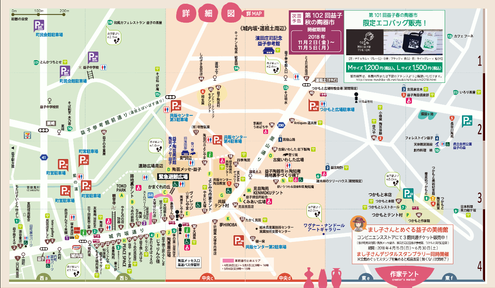
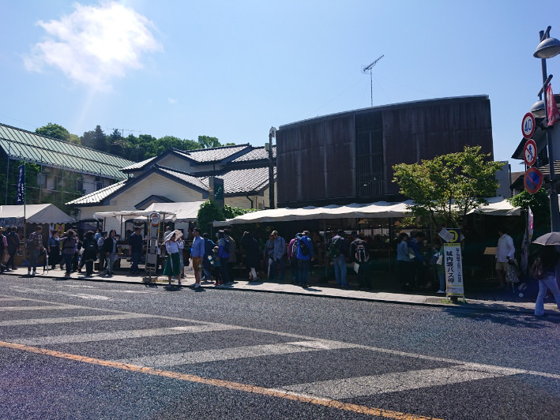
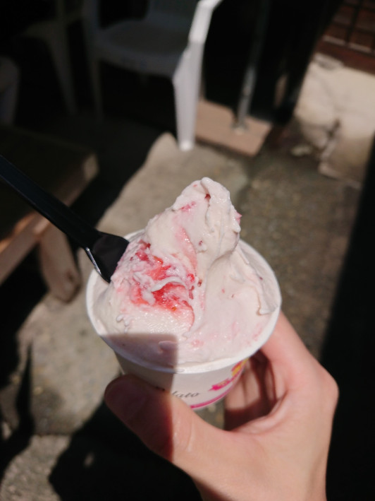
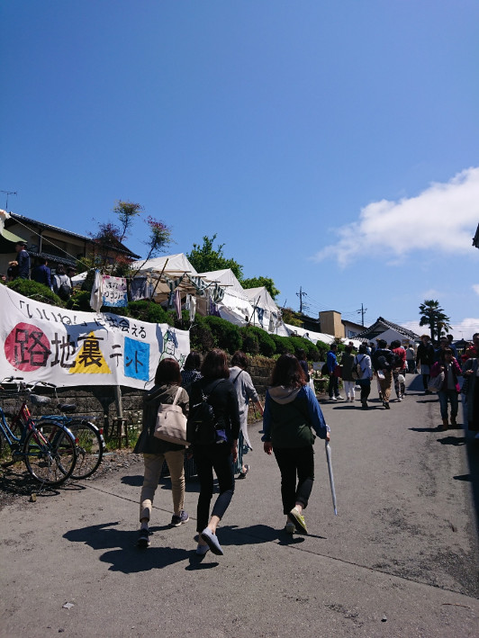
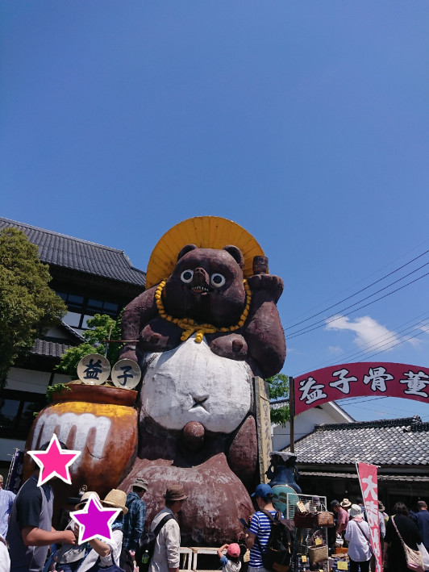
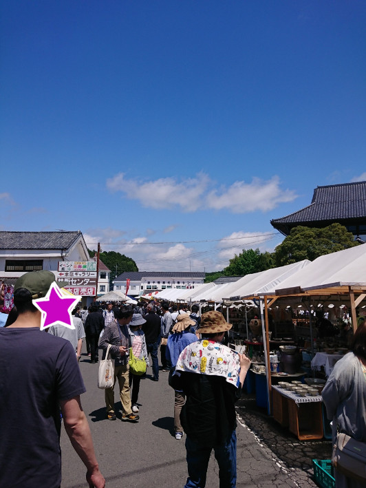
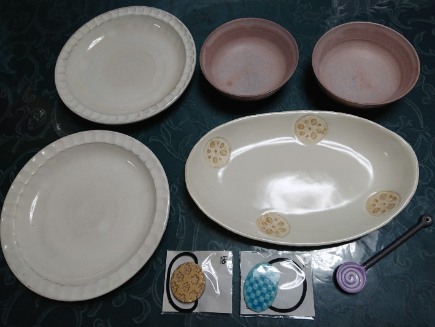

こんにちは、ゆずあふろです。  
先週の話ですが、ゴールデンウィークということで、以前から行ってみたかった益子の陶器市に出かけてきました。

この記事では「初参加ですが、こんな感じで楽しみました！」というのをレポートしてみようと思います。

<!--more-->

</br>

### 益子陶器市って？？
---

益子の陶器市は、栃木県の益子町で、毎年春と秋の年2回開催されていて、春はゴールデンウィークに、秋は11月の初旬に開催されているようです。  

今回私が行ってきたのは、「第101回益子春の陶器市」です。  
http://blog.mashiko-kankou.org/ceramics_bazaar/



2018年4月28日(土)〜5月6日(日)に開催されていて、私は5月4日(金)に行きました。  

</br>

### どうやって行くの？？
---

そもそも益子町がどこにあるのかイメージできていませんでしたが、今回私は埼玉県さいたま市から出発し、行きは電車を乗り継いで、帰りはバスと新幹線を乗り継いでみました。  

相当な混雑が見込まれるという話だったので、なるべく朝早く出て、遅くならないうちに帰ってこようということになりました。  

```
[行き]
大宮 〜 小山 (JR宇都宮線) 07:26 - 08:15
小山 〜 下館 (JR水戸線) 08:22 - 08:44
下館 〜 益子 (真岡鉄道真岡線) 08:52 - 09:36

[帰り]
益子駅 〜 宇都宮 (東野バス) 14:05 - 15:40 (渋滞込み)
宇都宮 〜 大宮 (東北新幹線) 16:34 - 16:58
```

帰りはやはり渋滞してしまっていて、バスが30分くらい遅れてしまいました。  
あと、宇都宮でお土産の餃子とか見てたタイムロスがありますね(^^;)  

</br>

### 会場はどんな感じ？？
---

駅に着いたら何とかなるんじゃないかと思って、あまり予習をして行かなかったのですが、想像以上に会場が広くて、お店もかなりたくさんある！！
ので、予習をして行くことをお勧めします。  

まず絶対必要なのが <b>陶器市マップ</b> です。益子町観光協会のホームページにリンクがあります。  

↓↓ 2018年春版の益子陶器市マップのPDFファイルのリンクです。  
http://www.mashiko-kankou.org/ceramics_bazaar/image/pdf/map_jap201804.pdf

このマップは益子駅や城内坂通りの入口などで、印刷されたものが配布されていました。  
心配ならばあらかじめ印刷して行った方がよいかもです。




(陶器市マップの詳細図の一部のスクリーンショットを使用させていただいております。)

会場は、だいたい以下のエリアに分かれているようでした。

* 城内坂通り沿いの常設店舗、テント村(マップ左下)
* 共販センターや陶芸メッセあたりの店舗、テント村(マップ中央)
* 里山通り沿いの常設店舗やテント村(マップ中央)
* 少し離れたところにある つかもとの店舗、テント村

こんなに広いという事を理解できてなくて、城内坂通りと共販センターのあたりしか見れませんでした。(単純に疲れたというのもあります。)

ちなみに益子駅から城内坂通りの入口までは少し距離があって、20分強歩きました。

だいたいのイメージができるように写真を貼っておきます。  
写真は午前中のものが多いのですが、午後になるともっと人が増えていました。
</br>
</br>

城内坂通り  



路地裏テント  


よこみち作家テント  


共販テント村  



</br>

### 戦利品
---

で、何を買ったの？？ってなると思うのですが、こんなのを買いました〜〜！！  
(もう少しいい感じの写真を撮れればよいのですが・・・(^^;))



* 粉引きの丸皿 (¥2000 × 2)
* レンコンの模様の長皿 (¥1900)
* ピンクの小鉢 (¥900 × 2)
* ぐるぐる模様のスプーン (¥400)
* ヘアゴム (¥800、¥500)

値段がうろ覚えなので、正確ではないのですが、だいたいこれぐらいでした。  
ずっとお魚用のお皿が欲しかったので、レンコンのお皿を見つけた時はとても嬉しかったです。


</br>

### 感想など
---

全般

* とにかく広いので、全部見たい人は体力が必要
* 午前中の方が少し空いている
* 器がたくさんあるので選びたい放題
* 飲食店もそこそこ充実
* フェス感覚で楽しめる！

持って行ってよかったもの

* 帽子、丈夫なリュック、1000円札

</br>

初参加レポートいかがだったでしょうか？  
とても満足な買い物ができたので、また機会があったら行きたいと思います！！

