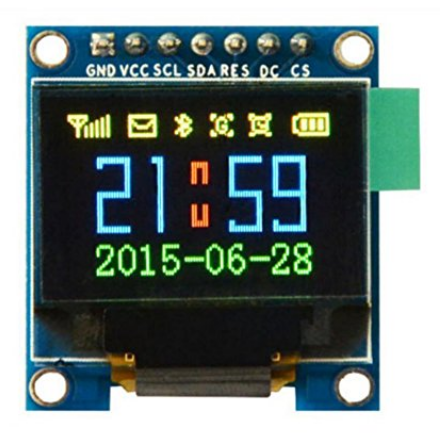
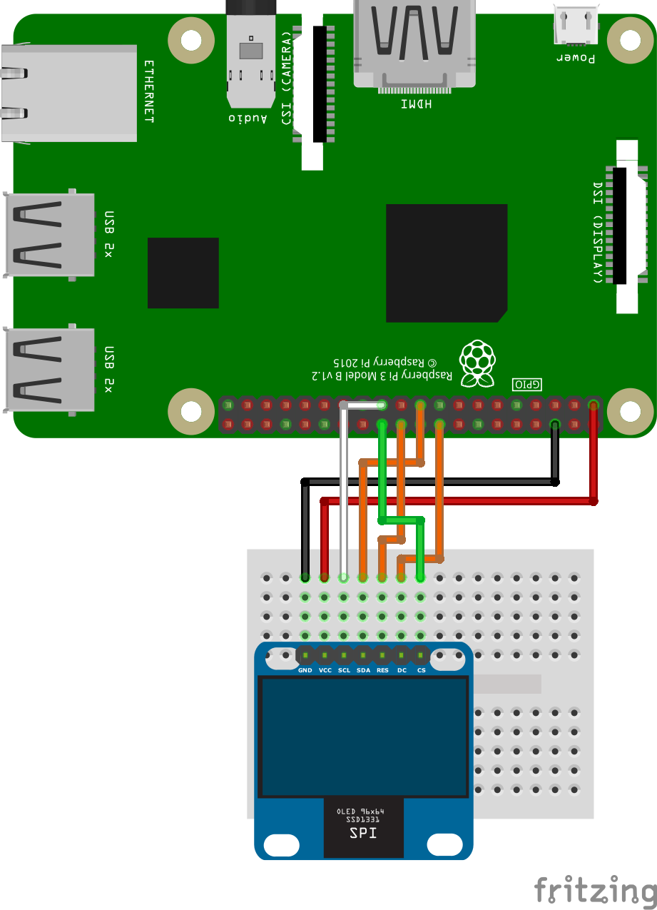

こんにちは、ゆずあふろです。  
積みボードに積みパーツ。(買ったけど使われることなく眠っているボードorパーツ)  
きっとあなたの家にもたくさんありますよね？！

今日は、Raspberry Pi 3 に、積みパーツとなっていた OLED(SSD1331) をつないで動かしてみたので、その方法をお届けします。  

<!--more-->

</br>

### 使用したOLEDについて
---

今回使ったOLEDはこちらです。  
HiLetgo の 0.95インチ SPI OLED ディスプレイ SSD1331 です。  
私はAmazonで買いました。購入当時(2018年1月)は1050円でした。  





データシートはこちらにありました。  
https://cdn-shop.adafruit.com/datasheets/SSD1331_1.2.pdf

当たり前ですが、買っただけでは動きません。  
インターネットの力を借りて、Raspberry Piで使えるサンプルプログラムと、GPIOへの接続方法を調べました。  

</br>

### Raspberry Piで使えるサンプルプログラムの導入
---

こちらの Luma.OLED というページで、サンプルプログラムが色々公開されています。  
素晴らしすぎて涙が出ます。  

https://luma-oled.readthedocs.io/en/latest/intro.html


まずは、[Installation](https://luma-oled.readthedocs.io/en/latest/install.html) のページを見ながら、Raspberry Pi上にサンプルプログラムをダウンロードします。  

```bash
$ sudo apt-get install python-dev python-pip libfreetype6-dev libjpeg-dev build-essential
$ sudo -H pip install --upgrade luma.oled
```

Python3 でやりたい方はこちらです。

```bash
$ sudo apt-get install python3-dev python3-pip libfreetype6-dev libjpeg-dev build-essential
$ sudo -H pip3 install --upgrade luma.oled
```

</br>

インストールコマンドを実行したディレクトリに luma.examples ディレクトリが以下のようにできていればよさそうです。

```bash
$ ls
luma.examples
$ ls luma.examples/
CONTRIBUTING.rst  README.rst  examples                setup.cfg  tests
LICENSE.rst       conf        luma.examples.egg-info  setup.py   tox.ini
```

</br>

### GPIOへの接続方法
---

こちらを先にやっとくべきかもでしたが、OLEDとRaspberry PiのGPIOを接続していきます。  
先ほどのページの [Hardware のSPIの部分](https://luma-oled.readthedocs.io/en/latest/hardware.html#i2c-vs-spi) の通りに接続します。  
ミニブレッドボードとオスメスのジャンパワイヤを7本使って、以下のように接続しました。  

---
| 　OLED　 | 　Pin名　 | 　　　役割　　　 | 　RPi Pin　 | 　RPi Function　 |
|:--:|:--:|:--:|:--:|:--:|
| 1 | GND | Ground | 17 | GND |
| 2 | VCC | +3.3V Power | 20 | 3V3 |
| 3 | D0 | Clock | 23 | GPIO 11(SCLK) |
| 4 | D1 | MOSI | 19 | GPIO 10(MOSI) |
| 5 | RST | Reset | 22 | GPIO 25 |
| 6 | DC | Data/Command | 18 | GPIO 24 |
| 7 | CS | Chip Select | 24 | GPIO8(CE0) |
---

</br>



</br>

### サンプルプログラムの実行
---

準備が整ったので、サンプルプログラムを実行してみます。  
サンプルプログラムは examplesディレクトリにある 拡張子が .py のファイルです。

```bash
ls examples/*.py
3d_box.py             font_awesome.py       savepoint.py
animated_gif.py       game_of_life.py       scrolling_pixelart.py
...
demo.py               picamera_video.py     weather.py
demo_opts.py          runner.py             welcome.py
```


実行方法の詳細は、luma.examplesのGitHubページに載っています。  
https://github.com/rm-hull/luma.examples

自分の使っているデバイス(SSD1331)に合わせて、以下のオプションを設定して、clock.py を実行します。  
<span style="color: red; ">(オプションを正しく設定してあげないと動きませんので注意！！)</span>

```bash
$ python3 examples/clock.py --interface spi --display ssd1331 --width 96 --height 64
```

---
| 　オプション　 | 　設定項目　 | 　設定した値　 |
|:--:|:--:|:--:|
| interface | i2cまたはspi | spi |
| display | OLEDの型番 | ssd1331 |
| width | 幅 | 96 |
| height | 高さ | 64 |
---

clock.py は、下のようなアナログ時計とデジタル時計を表示するサンプルでした。




</br>

他のサンプルプログラムも実行してみます。

```bash
$ python3 examples/pi_logo.py --interface spi --display ssd1331 --width 96 --height 64
```



こちらは、Raspberry Piのロゴが回転するアニメーションでした！！  
動画で撮ると微妙な感じになっていますが、カラー表示もきれいにできていました。  

サンプルがたくさんあるので、オリジナルのプログラムを作る場合は、似たようなサンプルを参考にしながら作れそうです。  
特に、Luma.OLED の [Python usage](https://luma-oled.readthedocs.io/en/latest/python-usage.html) や [API Documentation](https://luma-oled.readthedocs.io/en/latest/api-documentation.html) のページに使い方がまとめられているので、つまずいたらここを見ればよさそうです。

</br>

**【2018/5/28追記】**  

オプションを全部指定してあげなくても、confディレクトリの中にssd1331向けのコンフィギュレーションファイルがあって、それを指定してあげればオッケーでした。

```bash
$ python3 examples/pi_logo.py --config conf/ssd1331.conf
```
