こんにちは、ゆずあふろ([@yuzu_afro](https://twitter.com/yuzu_afro))です。  
記事を書くまで少し間が空いてしまいましたが、6/17(日)に「第8回 Raspberry Pi もくもく会（ラズパイ+Azureハンズオン）」を開催しました。

この日は、いつものもくもく会ではなくて、講師に日本マイクロソフトの太田 寛さんをお招きして、全員ハンズオンに参加してもらうスタイルで開催しました。  
（[#raspimoku](https://twitter.com/hashtag/raspimoku?src=hash) では初めての試みでした！）

<!--more-->

https://raspberry-pi-moku.connpass.com/event/89297/



</br>

### ハンズオン内容
---

今回のハンズオンは、「Azure上（クラウド側）にAzure IoT Hub リソースを作成し、クラウドに接続するデバイスとしてRaspberry Piを使用して、C言語のAzure IoT SDKのサンプルコードを動かしてみよう」という内容でした。

当日のハンズオンは以下の内容でした。

* 準備
* Azure IoT Hub 概要紹介
* Azure IoT Hub リソース作成（クラウド側）
* Azure IoT SDK 環境（C言語版）の構築（ラズパイ側）
* サンプルプログラムの実行

</br>

### 準備
---

今回は事前準備として、Azureのサブスクリプションを作成してもらってきていました。  
Azureのアカウントは無料で作成できますが、作成時にクレジットカードが必要です。  

Azureサブスクリプション契約の方法は、[こちら](https://aka.ms/iotkitholv4prep)の資料のP19〜23 に掲載されています。  
https://aka.ms/iotkitholv4prep  
（P19の「デバイスのセットアップ」以外を行います）

当日は、初めに自己紹介を行いつつ、PCとラズパイを会場のWi-Fiに接続してもらいました。  
ここでラズパイを会場のWi-Fiに接続できなかった方が数名おりまして、時間をロスしてしまった感があるので、いざという時のために予備をちゃんと準備しておくべきだったなというのが反省点です。

</br>

### Azure IoT Hubの概要
---

私が予備ラズパイの準備に手こずっている間に、太田さんが Azure IoT Hubの概要を解説されていました。  

当日の資料は[こちら](https://1drv.ms/p/s!Aihe6QsTtyqct-IJXYS-qnxHq6sRLw) になります。  
https://1drv.ms/p/s!Aihe6QsTtyqct-IJXYS-qnxHq6sRLw  

私はバタバタしていて全部を聞けていたわけではないのですが、Azureの料金体系についてや、Azure IoT Hubがどんな用途に適しているか、デバイス側のSDKの種類などを詳しく解説していただきました。

私が聞いていた範囲の要点をまとめます。（間違ってたらすみません。）

* Azureのサービスは無料期間（1ヶ月）が終了しても勝手に課金されることはない（安心！）
* クラウドのよいところは、スケールが簡単にできるところ
* Azure IoT Hubは、AWS GreengrassやOSSのKafkaのようなサービス
* デバイスとIoT Hubの情報のやりとりはHTTP/AMQP/MqTTが使用できる
* デバイス側のアプリケーションの開発には、Azure IoT SDK/Azure IoT Edge SDK を使用する（SDKはOSSで提供されている）
    * Azure IoT SDK には、組み込み機器向けのAzure IoT Device SDKと、サーバー向けのAzure IoT Service SDKがある
        * デバイスのOSは、Linux、Win32などをサポート
        * 開発言語は、C/C++、C#、Javascript、Python、Javaなど
    * Azure IoT Edge SDK は、コンテナベースのモジュール環境
        * ラズパイでもDockerを入れれば使える

</br>

### Azure IoT Hub リソースの作成（ハンズオン）
---
ここから実際に手を動かすところです。  
忘れてしまいそうなので、スクリーンショットとともに残しておきます。

Azureの [ポータルページ](https://portal.azure.com/) を開きます。

</br>

#### ダッシュボードとリソースグループの作成
---

まず始めに、ダッシュボードとリソースグループを作成します。  

Azureの各サービスはリソースという単位で提供されています。  
Webサーバー、データベース、ストレージの各種リソースを1つにまとめるのがリソースグループです。  
今回はIoT Hubしか使わないのでリソースグループにしなくてもよいかもしれませんが、リソースグループを作成しておくと削除する時もまとめてできるので便利だそうです。

ダッシュボードは、作成したリソースグループやリソースを登録して、簡単にアクセスできるようにするためのものです。

今回は yuzuafro_raspimoku_20180617 というリソースグループを作成し、ダッシュボード Raspimoku に登録しました。  

ちなみに、ハンズオンでは、ここまでは事前準備してくることとなっておりました。  
（当日も説明していただきました）  

_リソースグループメニューのスクリーンショット_

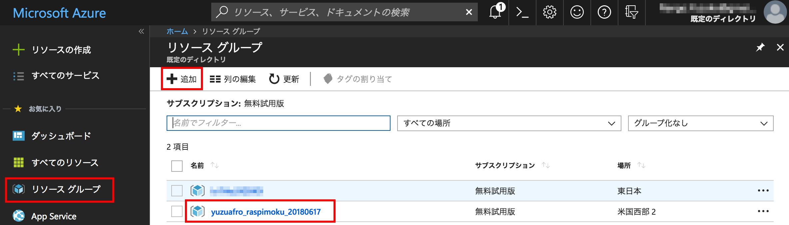

_ダッシュボードのスクリーンショット_  

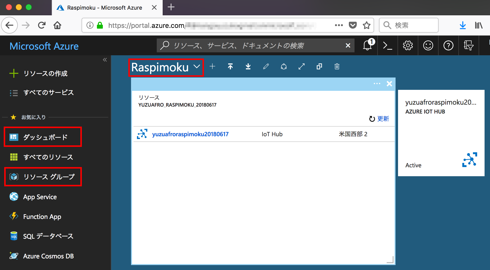

（このスクリーンショットは IoT Hub のリソースを作成後のものになります）

</br>

#### IoT Hub の作成
---

次に、IoT Hub のリソースを作成します。  
「リソースの作成」を選択し、検索窓に "IoT" などと入力すると候補が出てくるので、「IoT Hub」を選択します。  
（ここ、1人でやったらつまずきそうな気がします、検索窓が上にもあるし、リソース名わからなかったら進めない・・・）

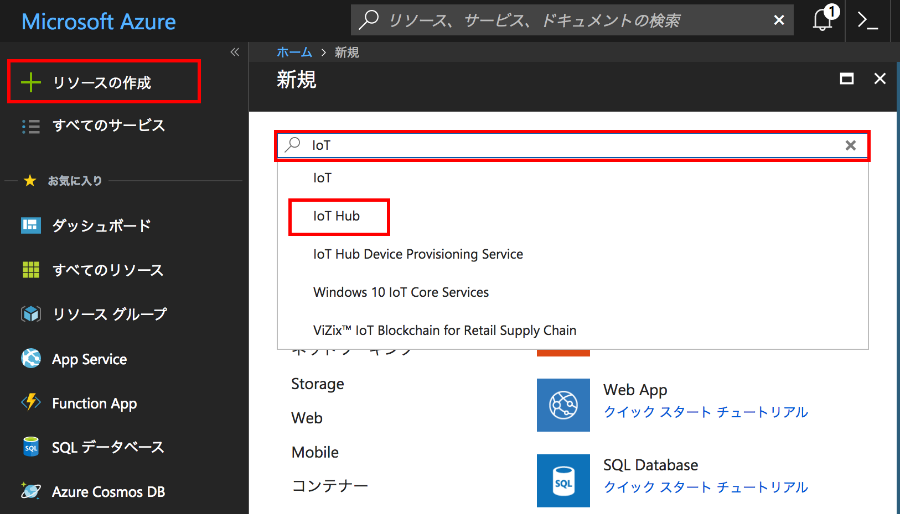

次の画面で、IoT Hub の新規作成を選択すると、以下の画面になります。  
ここで、Subscription、Resource Group、Region を選択、IoT Hub Name を入力して「Next: Size and scale」を選択します。

Regionは、ハンズオンでは 米国西部2 を使用しました。  

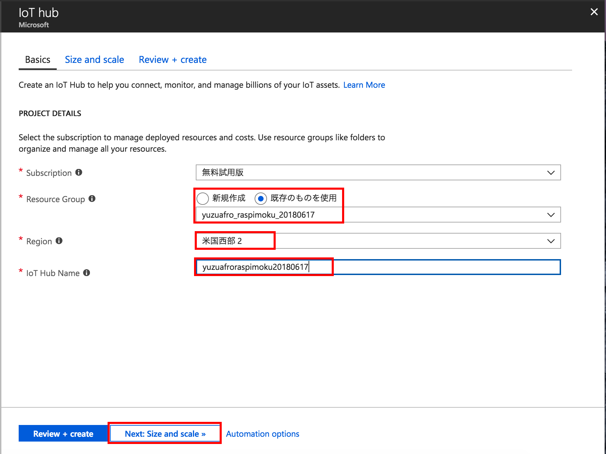

Size and scale の画面の、Pricing and scale tier で「F1: Free tier」を選択し「Review + create」を選択します。
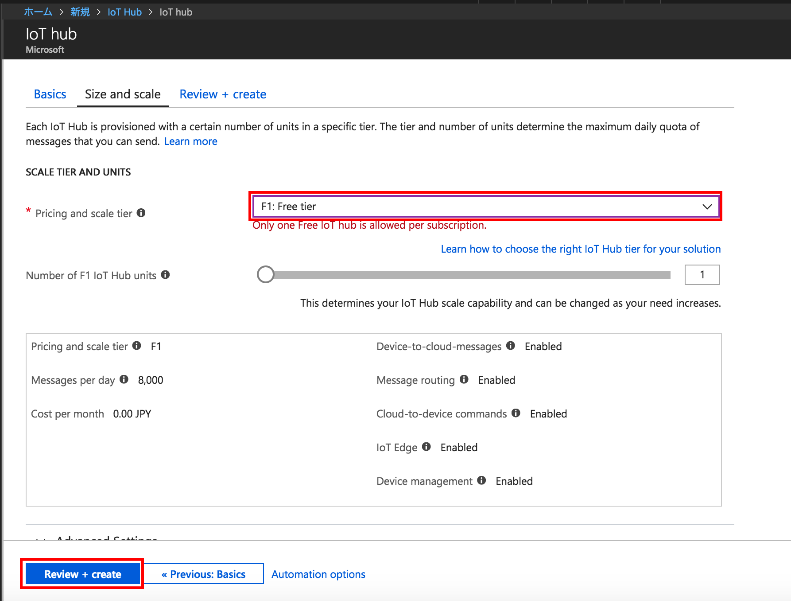

IoT Hub が作成されると、ダッシュボードにピン留めしますか？と聞かれるのでピン留めします。  
ピン留めすると下のようにダッシュボードからIoT Hubに簡単にアクセスできるようになります。  
ピン留めする前にメッセージが消えてしまった場合は、上部のベルのアイコンからピン留め設定できました。  
ダッシュボードから、IoT Hub のメニューを選択します。  
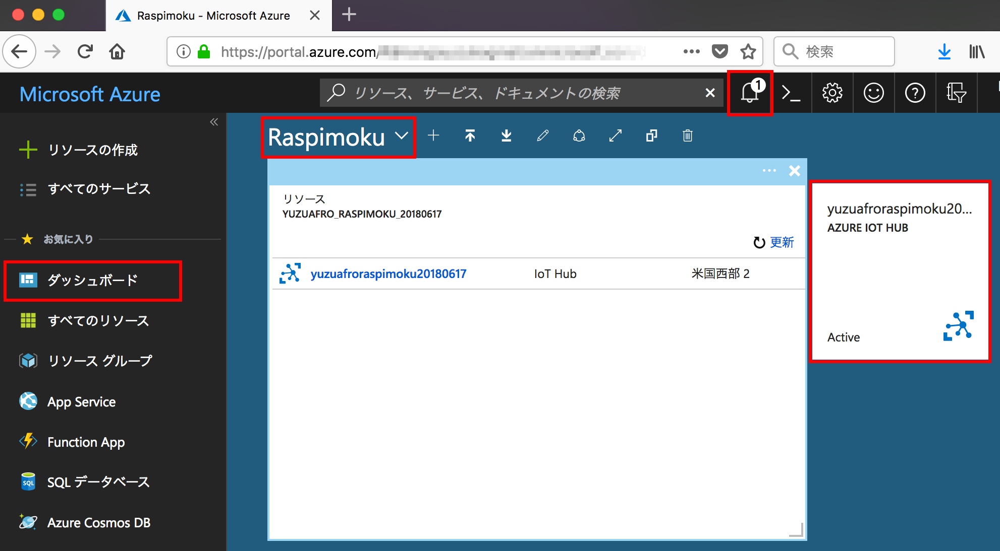

</br>

#### IoT devices の設定
---

IoT Hub のリソースを選択すると、Overview が表示されていると思います。  
この左側のメニューを下にスクロールさせて「IoT devices」を選択します。

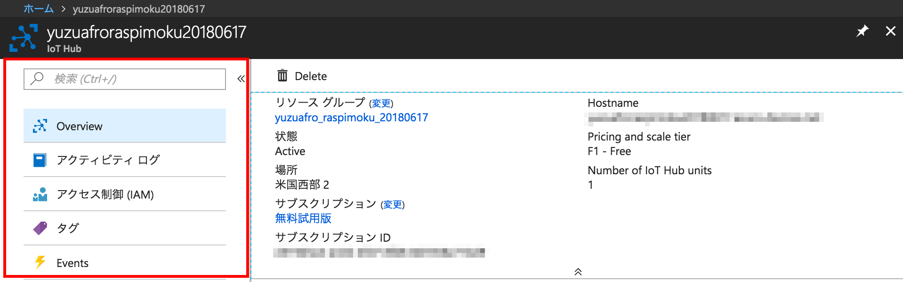

「IoT devices」を選択したら、「Add」からデバイスを登録します。  
右側に「Add Device」のメニューが表示されるので、Device ID を入力して「Save」を選択します。

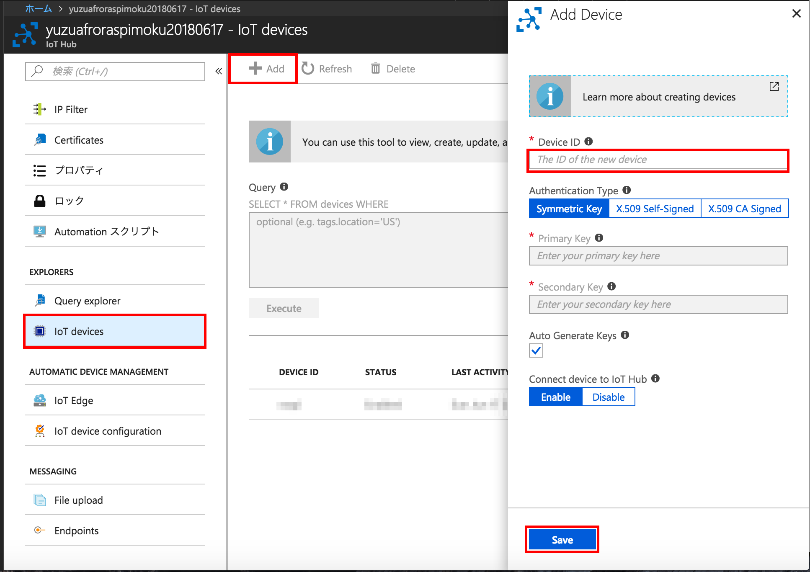

作成されたデバイスを選択すると、以下のような画面になります。  
Primary Key と Secondary Key が生成されています。  
上2つが実際のキーの値で、下2つはデバイス側に設定する文字列（上2つのキーを使っている）となります。  
このキー（を使った文字列）は後ほどラズパイに設定するのでこのページを開いておくか、右側の青いコピーボタンを使って、どこかにコピーしておきましょう。  

一般的には、誰かに教える場合は Secondary Key を使うそうですが、今日はホビー用途ということなので、どちらでもよいでしょうとのことでした。

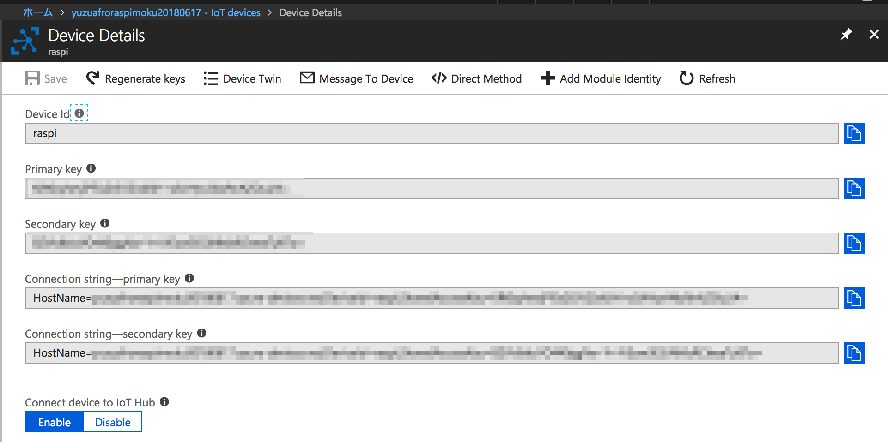
</br>

### Azure IoT SDK環境の構築
---

さてさて、ようやくラズパイ側の設定に入ります。  
今回は、C言語のSDKを使います。  
https://github.com/Azure/azure-iot-sdk-c

ちなみに Python や Node.js のSDKもありますが、Raspberry Piにプリインストールされている python や node のバージョンが古いと動作できないので、SDKで必要なバージョンを実行できる環境をラズパイに準備する必要があるようです。  

C言語のSDKはバージョンは気にしなくて大丈夫そうです(^^;)

ということで、あとは↑の GitHub の Readme を見ながら、ラズパイに環境を整えていきます。  
Raspbian は、Debian系のOSということで、「Packages and Libraries」の「Linux:Device SDK on apt-get」の内容を実行していきます。  
https://github.com/Azure/azure-iot-sdk-c/blob/master/doc/devbox_setup.md#linux

Raspberry Pi のターミナルを起動して、必要なパッケージをインストールします。

```bash
sudo apt-get update
sudo apt-get install -y git cmake build-essential curl libcurl4-openssl-dev libssl-dev uuid-dev
```

CMake と gcc のバージョンを確認します。
```bash
cmake --version
gcc --version
```

git clone して、SDKのソースコードをRaspberry Pi 上にダウンロードします。  
（当日は -b オプションは使いませんでした）
```bash
git clone -b <yyyy-mm-dd> --recursive https://github.com/Azure/azure-iot-sdk-c.git
```

</br>

### サンプルを動かしてみる
---

SDKのソースコードをダウンロードできたら、先ほどのページの続きの「Build the C SDK in Linux」を実行していきます。

GitHub のセットアップ手順では、cmake ディレクトリを作成して cmake を行なっていますが、
この CMake を行う前に、クラウド側で作成した Azure IoT Hub のキーを設定する箇所がありますので、編集します。  

SDKをダウンロードしたディレクトリに移動します。（以下は私の例です）
```bash
/home/pi/develop/azure-iot-sdk-c
```
今回は、iothub_client/samples/iothub_convenience_sample のサンプルを実行してみます。  

以下のファイルを変更します。  
iothub_client/samples/iothub_convenience_sample/iothub_convenience_sample.c  
connectionString を、IoT devices の設定ページで確認した Connection String に書き換えます。  
（HostName= の部分からコピーペーストしてOKです）
```c
/* Paste in your device connection string  */
static const char* connectionString = "[device connection string]";
↓↓↓ 書き換える
static const char* connectionString = "HostName=xxxxxxxx.azure-devices.net;xxxxxxxx";
#define MESSAGE_COUNT        5
static bool g_continueRunning = true;
```

キーの設定ができたら、ビルドします。
```bash
mkdir cmake
cd cmake
cmake ..
cmake --build .
```

ビルドが終了すると、以下の場所に iothub_convenience_sample の実行ファイルが作成されますので、実行してみましょう。  
/home/pi/develop/azure-iot-sdk-c/cmake/iothub_client/samples/iothub_convenience_sample/iothub_convenience_sample
```
cd iothub_client/samples/iothub_convenience_sample
./iothub_convenience_sample
```

IoT Hub にメッセージを5回送ってコールバックが帰ってくるかを確認しています。  
その後 IoT Hub からのメッセージ受信待ちになります。  
Enterキーが押下されるとプログラムが終了します。  

```
This sample will send 5 messages and wait for any C2D messages.
Press the enter key to end the sample

Creating IoTHub handle
Sending message 1 to IoTHub
Sending message 2 to IoTHub
Sending message 3 to IoTHub
Sending message 4 to IoTHub
Sending message 5 to IoTHub
The device client is connected to iothub
Confirmation callback received for message 1 with result IOTHUB_CLIENT_CONFIRMATION_OK
Confirmation callback received for message 2 with result IOTHUB_CLIENT_CONFIRMATION_OK
Confirmation callback received for message 3 with result IOTHUB_CLIENT_CONFIRMATION_OK
Confirmation callback received for message 4 with result IOTHUB_CLIENT_CONFIRMATION_OK
Confirmation callback received for message 5 with result IOTHUB_CLIENT_CONFIRMATION_OK
```
次にプログラムを起動させた状態のまま、IoT Hub からメッセージを送ってみます。  
クラウド側に戻って、先ほど開いていた IoT device の Device Details のページを開きます。  
上部にある「Message to Device」を選択します。  

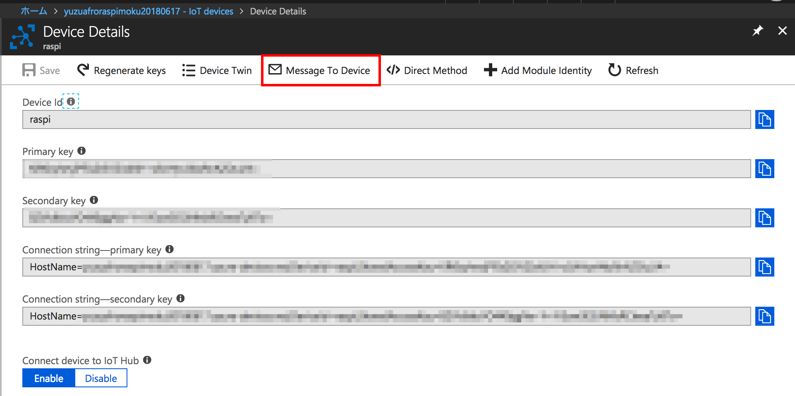

Message Body に "test" を入力して、上部の「Send Message」を押下します。

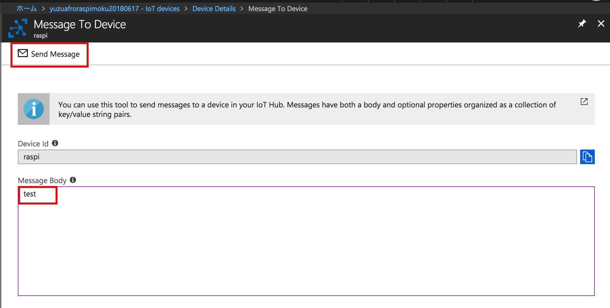

Raspberry Pi でプログラムを実行させているコンソールに、test のメッセージが受信できていれば成功です。  
```
Received Binary message
Message ID: <unavailable>
 Correlation ID: <unavailable>
 Data: <<<test>>> & Size=4

```

プログラムの中身を詳しく知りたい方は、サンプルコードの中身を見ていくとよさそうです。  
[サンプルコード](https://github.com/Azure/azure-iot-sdk-c/tree/master/iothub_client/samples) は他にもたくさん準備されていますが、基本的に connectionString を書き換えれば動かせるようです。  
また、`iothub_ll_` から始まっているサンプルは、Low Level なものとなっているそうです。

</br>

### 感想など
---

ある程度わかってはいたのですが、Azure側の知識と、デバイス（Raspberry Pi）側の知識の両方が必要になってくるので、ちょっとやってみようかな〜と思っても1人で始めるのはなかなかハードルが高いなと感じました。  

Azure側のサービス（リソース）の名前を理解していないと使いこなせなそうなのもハードルを少し上げている気がします。  

ただ、今回のようにハンズオンを経験できると、最初につまづきそうなところを取り除いてもらえるので、とてもよかったです。  

今回講師をしてくださった太田さんは、ALGYAN（あるじゃん）さんという団体で、定期的に Azure IoT のイベントを開催されているようなので、これから始めてみたい方はこちらをチェックしておくのがよさそうです！



</br>

さてさて、長文になりましたが読んでいただきありがとうございました。  
次回の Raspberry Pi もくもく会 は、7/21(土)の開催です。  
ぜひご参加ください！！

Connpassも公開しております。
お申し込みはこちらからどうぞ！！  
（キャンセル待ちになってしまいますが）  
https://raspberry-pi-moku.connpass.com/event/92749/
